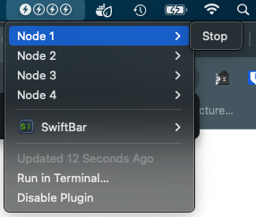

# tp2bar 

A Mac OS [swiftbar](https://github.com/swiftbar/SwiftBar) plugin written in rust which display's the power status of the 4 nodes in a [Turing Pi 2 Cluster](https://turingpi.com/).

This shows node 1 is on and the drop down menu that allows you to turn it off.

## Installation:

I haven't setup releases yet so you'll have to download and compile it. `cargo build --release` then copy the `target/release/tp2bar` file to your swiftbar plugin directory as `tp2bar.1m.rs` 

The default password is hardcoded until I can get the swiftbar preferences to work right, you can copy the [tp2bar.json.example](src/tp2bar.json.example) file beside the bin in the plugin directory, removing the .example and updating the encoded PW in the json file.

Note:
This pligin should also work with xbar/bitbar but has not been tested.

